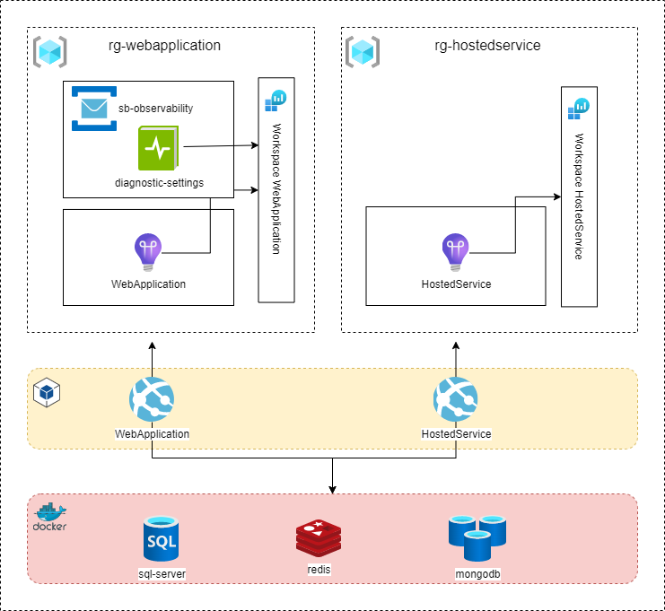

# Introdução
Este projeto é uma demostração de envio de telemetria de aplicações distribuidas para o **Application Insights**.

## Premissas
- Validar como o insights faz o correlacionamento de métricas e logs distribuidos das mesma operação em workspaces separados;
- Validar o trackeamento de dependências de bibliotecas de terceiros.

## Projeto

## Referências

| Nome  |  Descrição |
| :------------ | :------------ |
| Microsoft.ApplicationInsights.AspNetCore | Biblioteca para coleta de telemetria para aplicações Web (http)  |
| Microsoft.ApplicationInsights.WorkerService |  Biblioteca para coleta de telemetria para aplicações No-Http (console, workers, consumers, hostedservice, etc.)  |
| Microsoft.Extensions.Azure  |  Biblioteca para clients de comunicação com os serviços da azure que integra com o ILogger e Activity  |
| Azure.Messaging.ServiceBus  |  Biblioteca para envio de mensagens pora o service-bus |
| Microsoft.Extensions.Caching.StackExchangeRedis  | Biblioteca para integrar o IDistribuitedCache com o Redis  |
| MongoDB.ApplicationInsights  | Biblioteca para coletar a telemetria do mongoDB com o application insights  |
| MongoDB.ApplicationInsights.DependencyInjection  | Biblioteca para injetar as dependências do MongoDB.ApplicationInsights  |
